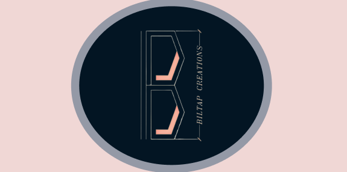
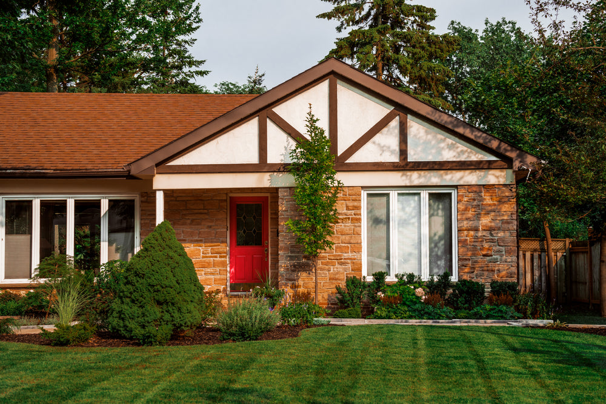
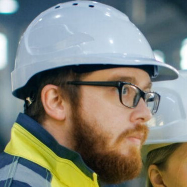

<!DOCTYPE html>
<html lang="en">

<head>
    <meta charset="UTF-8">
    <meta name="viewport" content="width=device-width, initial-scale=1.0">
    <link rel="stylesheet" href="https://maxcdn.bootstrapcdn.com/bootstrap/4.5.2/css/bootstrap.min.css">
    <link href="https://maxcdn.bootstrapcdn.com/bootstrap/4.5.2/css/bootstrap.min.css" rel="stylesheet">
    <link rel="stylesheet" href="https://cdnjs.cloudflare.com/ajax/libs/font-awesome/5.15.3/css/all.min.css">
    <link rel="stylesheet" href="CSS/login.css">
    <title>ConstructQR</title>
</head>

</head>

<body>

    <nav class="navbar navbar-expand-lg navbar-light bg-light fixed-top">
        

            
            <button class="navbar-toggler" type="button" data-bs-toggle="collapse" data-bs-target="#navbarNav"
                aria-controls="navbarNav" aria-expanded="false" aria-label="Toggle navigation">
                
            </button>

            

                <ul class="navbar-nav ml-auto">
                    <li class="nav-item">
                        <a class="nav-link" href="#about-us-section">About Us</a>
                    </li>
                    <li class="nav-item">
                        <a class="nav-link" href="#goal-section">Goal</a>
                    </li>
                    <li class="nav-item">
                        <a class="nav-link" href="#projects-section">Projects</a>
                    </li>
                    <li class="nav-item">
                        <a class="nav-link" href="#assets-section">Assets</a>
                    </li>
                    <li class="nav-item">
                        <a class="nav-link" href="#footer-section">Services</a>
                    </li>
                    <li class="nav-item">
                        <a class="nav-link" href="#footer-section">Contact</a>
                    </li>
                    <li class="nav-item">
                        <button class="nav-link btn btn-link" onclick="openLoginModal()">Login</button>
                    </li>
                </ul>
            

        

    </nav>

    

        

            

                

                    <h5 class="modal-title">ConstructQR</h5>
                    <button type="button" class="close" onclick="closeLoginModal()">
                        &times;
                    </button>
                

                

                    <!-- Login Form -->
                    <form id="loginForm" action="login.php" method="POST">
                        

                            <?php
                            if (isset($_GET['error'])) {
                                echo "
" . $_GET['error'] . "
";
                            }
                            ?>
                        

                        

                            

                                <i class="fas fa-envelope"></i>
                            

                            <input type="email" class="form-control" id="email" name="email" placeholder="Email"
                                required>
                        

                        

                            

                                <i class="fas fa-lock"></i>
                            

                            <input type="password" class="form-control" id="password" name="password"
                                placeholder="Password" required>
                        

                        <input type="checkbox" class="chk" id="chk"> Show Password</input>  

                        <button type="submit" class="btn btn-secondary">Login</button>
                    </form>
                

            

        

    

    

        

    

    <main class="flow content-grid">
        <h1 class="title" id="about-us-section">Builtap Creations</h1>
        
<i>Builtap Creations </i> is a business entity that specializes in the planning, execution,
            and
            management of building projects. These projects can vary widely in scale and complexity,
            ranging
            from residential homes and commercial buildings to infrastructure such as roads, bridges,
            and dams.
            Construction companies typically employ a diverse range of professionals, including
            architects,
            engineers, project managers, skilled tradespeople, and laborers, who work together to bring
            construction projects to fruition. Their services may include site preparation, building
            design and
            engineering, procurement of materials, construction, and post-construction maintenance and
            support.

        <section>
            <h2 class="content" id="goal-section">What is our goal?</h2>
            
Construction companies set goals to ensure the successful completion of projects while
                maintaining high
                standards of safety, quality, and efficiency.
                Key objectives typically include prioritizing safety excellence by reducing accidents
                and adhering to
                strict safety protocols. Additionally, achieving timely project completion is crucial
                for client
                satisfaction and reputation management.
                Cost control and profitability goals involve accurately budgeting projects, optimizing
                resource
                allocation, and maximizing margins. Building strong client relationships is also a
                priority, with a
                focus on understanding client needs, providing exceptional service,
                and fostering open communication.
                Embracing innovation and technology helps enhance productivity and competitiveness,
                while promoting
                sustainability and environmental responsibility aligns with modern societal
                expectations. Investing in
                employee development and engagement fosters a skilled and motivated workforce,
                while community engagement and social responsibility demonstrate a commitment to making
                positive
                contributions beyond project completion.
                Overall, construction companies strive to achieve these goals to deliver successful
                projects, uphold
                industry standards, and contribute positively to their stakeholders and communities.

        </section>

        <section>
            <h2 class="content" id="projects-section">Projects</h2>
            

                

                    

                        
                        

                            <h5 class="card-title">Buildings</h5>
                        

                    

                

                

                    

                        
                        

                            <h5 class="card-title">Houses</h5>
                        

                    

                

                

                    

                        
                        

                            <h5 class="card-title">Warehouses</h5>
                        

                    

                

                

                    

                        
                        

                            <h5 class="card-title">Condos</h5>
                        

                    

                

            

        </section>

        <section>
            <h2 class="content" id="assets-section">Assets</h2>
            

                

                    
                

                

                    
                

                

                    
                

                

                    
                

            

        </section>

        

            

                

                    

                    

                    

                        

                            
                        

                        

                    

                

            

        

    </main>  

    

        <h5>Biltap Creations</h5>
    

    
    
    
    
    

</body>

</html>

    <?php include_once ('Temp/footer.html'); ?>

